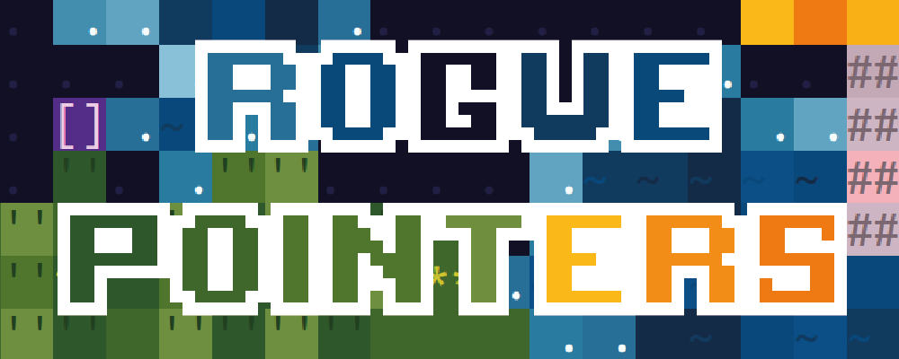
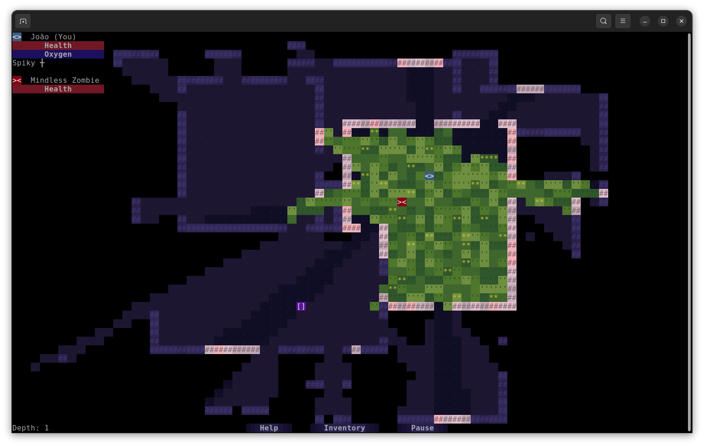

Roguelike game in C using ncurses! Developed as a project for the IT Laboratories II (Laboratórios de Informática II) class, part of the first year's curriculum of the Software Engineering bachelor's degree at University of Minho.

This project obtained a final grade of 19/20 💎



## Setup  ⚙️

To build the project and start the application:
```bash
make run
```
To build the project:
```bash
make
```

This project requires ncurses for terminal graphics and SDL2 for audio (installation example for a debian based system):

```bash
sudo apt-get install libncurses-dev libsdl2-dev
```

## Group 👥

- **A104356** [João d'Araújo Dias Lobo](https://github.com/joaodiaslobo)
- **A104179** [Sara Azevedo Lopes](https://github.com/Zaninhazevedo)
- **A104439** [Rita da Cunha Camacho](https://github.com/ritacamacho)
